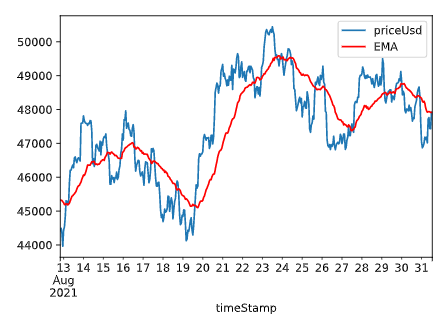

# ₿itTracker

Bitcoin Price Tracker - A program where I play with my own trading algorithms.

This program is for educational purpose only, not for finance or anything else. I am not responsible for your financial consequences :)

 

---

## To-dos:
- Add indicators: RSI, ...
- Alarm/Notification for Overbought/Oversold
- While loop to update price constantly (or just daily)
- Price API: https://messari.io/
- Learn and use buy the dip algorithm in text file (Bin) 
- Finding a backtest method
- Use Binance API from Toi di code dao video

## Buy/Sell indicators to check out
- Cross RSI in <25 / >75 region
- Supertrend indicator / algorithm https://www.elearnmarkets.com/blog/supertrend-indicator-strategy-trading/

