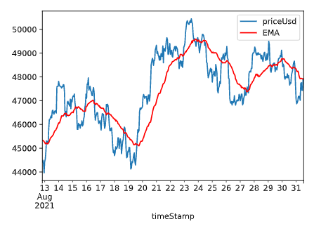

# ₿itTrack

Bitcoin Price tracker - A program that gives trading signal for Bitcoin based solely on EMA50 and price on H1 timeframe.

This program is for educational purpose only, not for finance or anything else. I am not responsible for your financial consequences :)

 

---

## To-dos:
- Add indicators: RSI, ...
- Alarm/Notification for Overbought/Oversold
- While loop to update price constantly (or just daily)
- API: https://messari.io/